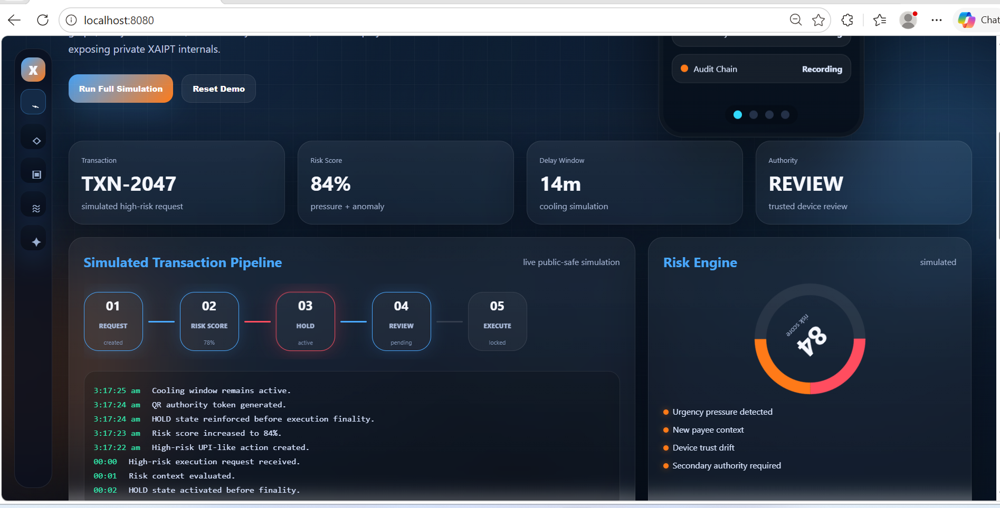

---

# XAIPT™

### Execution Governance • Runtime Authority • HOLD-Before-Finality

#### Human Authority Before Irreversible Execution

<br>

[](https://xaipt.com/)
[](https://github.com/raajmandale/XAIPT-GUARD)
[](https://raajmandale.in/)
[](https://github.com/raajmandale)

---

## 🧠 What is XAIPT?

XAIPT is a runtime-governance and authority-aware execution research ecosystem exploring how irreversible digital actions can be:

- delayed
- bounded
- reviewed
- audited
- approved

through human authority before final execution.

> Can visibility, authority review, delay windows, runtime accountability, and bounded execution become protection primitives in AI-era digital infrastructure?

---

## ⚡ Core Runtime Principle

```text
REQUEST
   ↓
RISK DETECTION
   ↓
HOLD ACTIVATED
   ↓
AUTHORITY REVIEW
   ↓
APPROVE / DENY
   ↓
CONTROLLED EXECUTION
```

---

## 🛡️ Runtime Doctrines

| Doctrine | Meaning |
|---|---|
| HOLD Before Finality | High-risk execution pauses before irreversible state transition |
| Authority Before Execution | Human review exists before consequence |
| Visibility Before Trust | Runtime states remain reviewable |
| Delay As Protection | Cooling windows reduce irreversible damage |
| Bounded Execution | Execution remains contained until authority resolves |
| Human Override | Human authority remains above automation |

---

## 🧩 Ecosystem Architecture


<br>

| Surface | Purpose | Status |
|---|---|---|
| XAIPT Root | Runtime-governance ecosystem | ACTIVE |
| XAIPT-GUARD | Public runtime simulation | ACTIVE |
| Decision Runtime | HOLD / REVIEW / APPROVE logic | RESEARCH |
| Runtime Visibility | Audit telemetry & execution visibility | ACTIVE |
| Future Labs | AI-era operational trust research | FUTURE |

---

## 🚀 Runtime Authority Flow


XAIPT treats execution as a governed runtime sequence rather than an instant irreversible action.

---

## 🌉 Public / Private Boundary


XAIPT publicly demonstrates:

- runtime governance surfaces
- conceptual execution flows
- authority review concepts
- delay-window simulations
- telemetry visibility
- audit-visible governance

XAIPT does **not** expose:

- financial integrations
- production transaction systems
- private enforcement layers
- proprietary runtime internals
- operational vault systems

---

## 🧪 XAIPT-GUARD™

XAIPT-GUARD is the public simulation branch of XAIPT.

It demonstrates:

- HOLD-before-finality runtime
- authority review states
- runtime visibility
- audit playback
- bounded execution
- delay-window governance
- human-controlled runtime decisions

<br>

| Surface | Link |
|---|---|
| XAIPT Runtime | https://xaipt.com/ |
| XAIPT-GUARD | https://github.com/raajmandale/XAIPT-GUARD |
| Cinematic Runtime | https://raajmandale.github.io/XAIPT-GUARD/public-demo/cinematic/runtime-experience-engine.html |

---

# 📺 Runtime Demonstration Surface

## XAIPT Runtime Surface



XAIPT-GUARD™ demonstrates:

- HOLD-before-finality
- bounded execution
- runtime interruption
- delay governance
- trusted-device review
- public-safe execution visibility

---

## Audit & Authority Visibility


Execution states remain:

- reviewable
- audit-visible
- authority-aware
- bounded before irreversible consequence

---

## 🧭 Research Direction

XAIPT currently explores:

- HOLD-before-finality systems
- authority-aware execution
- bounded execution models
- delayed execution windows
- runtime visibility architecture
- trusted-device review
- audit-visible governance
- human-centered runtime systems
- AI-era operational trust
- strategic friction as protection

---

## ⚠️ Research Boundary

XAIPT is:

- ✅ a runtime-governance research ecosystem
- ✅ a public-safe simulation environment
- ✅ a conceptual execution-governance architecture
- ✅ a runtime visibility exploration layer

XAIPT is NOT:

- ❌ a banking platform
- ❌ a UPI processor
- ❌ a payment gateway
- ❌ a fraud-monitoring engine
- ❌ a live execution controller
- ❌ a law-enforcement system
- ❌ deployed financial infrastructure

---

## 🧬 Systems Philosophy

> Protection can emerge not only from detection —
> but also from runtime execution design itself.

XAIPT explores whether:

- visibility
- review
- delay
- accountability
- authority
- bounded runtime states

should become first-class primitives in AI-era digital systems.

---

## 🌌 Related Research Ecosystem

| Ecosystem | Direction |
|---|---|
| QBAIX™ | Hybrid Compute Infrastructure Research |
| XPADI™ | Survivability-Governed Data Systems |
| Mandale-OS™ | Runtime Memory & Execution Intelligence Research |

---

# 👨‍💻 Founder

## Raaj Mandale

Systems Architect • Runtime Systems Research • Survivability Infrastructure

<br>

| Surface | Link |
|---|---|
| Official Website | https://raajmandale.in/ |
| GitHub | https://github.com/raajmandale |
| ORCID | https://orcid.org/0009-0005-9810-1655 |
| OpenAlex | https://openalex.org/A5127026877 |
| Zenodo Research | https://zenodo.org/communities/xmeck/ |

---

## ❄️ Current Status

XAIPT ecosystem structure, runtime doctrine, public positioning, and governance direction are currently considered:

# STABLE / FROZEN

Pending future expansion into:

- deeper runtime simulations
- authority-system experiments
- telemetry surfaces
- governance research labs

---

# XAIPT™

### HOLD Before Finality • Visibility Before Consequence

#### Human Authority Before Irreversible Execution