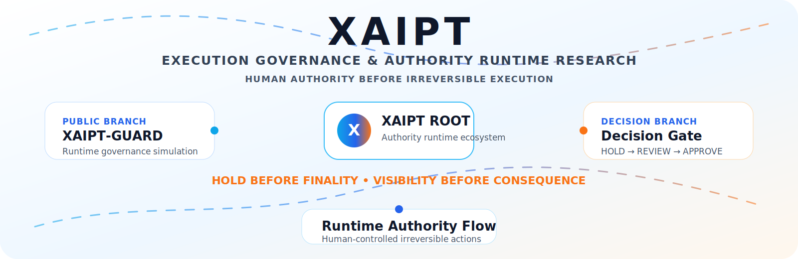
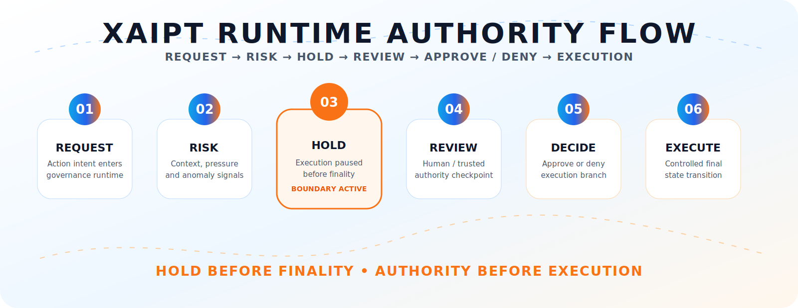
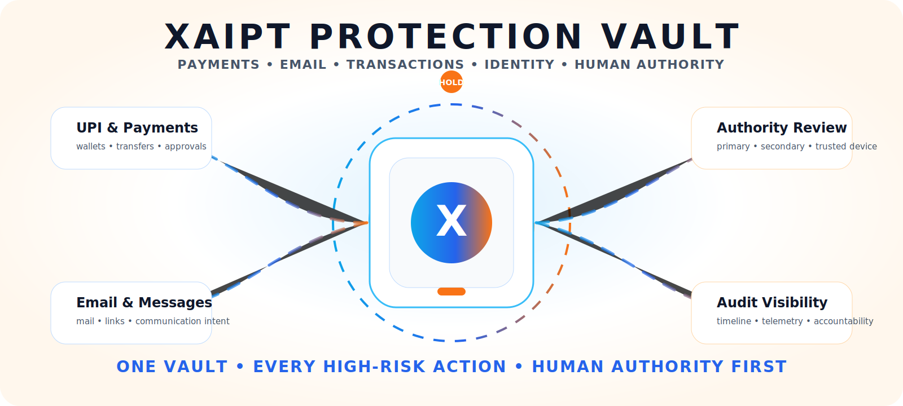
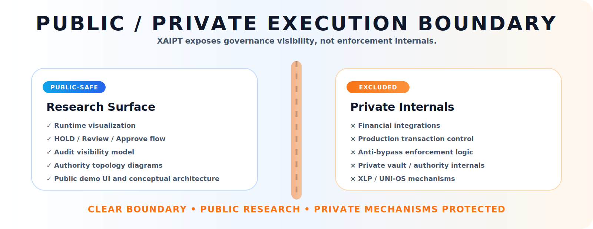
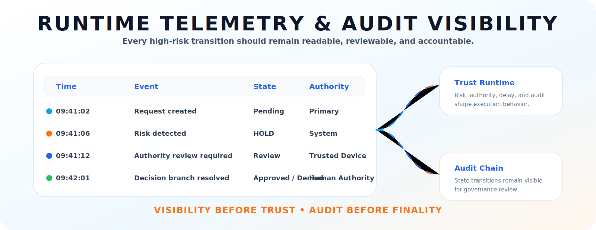

<p align="center">
  
</p>

---

<p align="center">

# XAIPT™

### Execution Governance • Runtime Authority • HOLD-Before-Finality

#### Human Authority Before Irreversible Execution

</p>

---

<p align="center">

[](https://xaipt.com/)
[](https://github.com/raajmandale/XAIPT-GUARD)
[](https://raajmandale.in/)
[](https://github.com/raajmandale)

</p>

---

# 🧠 XAIPT™

XAIPT is a runtime governance and authority-aware execution research ecosystem exploring how irreversible digital actions can be:

- delayed,
- bounded,
- reviewed,
- audited,
- and approved

through human authority before final execution.

XAIPT investigates whether:

> visibility, authority review, delay windows, runtime accountability, and bounded execution can become protection primitives in AI-era digital infrastructure.

---

# 🌐 Why XAIPT Exists

Modern digital systems increasingly prioritize:

- instant execution,
- automation,
- AI-assisted workflows,
- zero-friction transactions,
- autonomous runtime decisions,
- and irreversible execution speed.

This creates a growing infrastructure challenge.

Critical actions now occur across:

- payments,
- communication,
- approvals,
- identity systems,
- access control,
- remote execution,
- AI-triggered actions,
- and operational runtime environments

without meaningful interruption or authority review.

XAIPT explores whether:

- strategic friction,
- delayed execution,
- authority checkpoints,
- runtime visibility,
- and auditability

can become infrastructure-grade protection layers.

---

# ⚡ Core Runtime Principle

```text
REQUEST
   ↓
RISK DETECTION
   ↓
HOLD ACTIVATION
   ↓
AUTHORITY REVIEW
   ↓
APPROVE / DENY
   ↓
CONTROLLED EXECUTION
```

---

# 🛡️ XAIPT Runtime Doctrines

| Doctrine | Meaning |
|---|---|
| HOLD Before Finality | High-risk execution pauses before irreversible state transition |
| Authority Before Execution | Human review exists before consequence |
| Visibility Before Trust | Runtime states remain reviewable |
| Delay As Protection | Cooling windows reduce irreversible damage |
| Runtime Accountability | Decisions remain explainable |
| Audit Visibility | Execution states remain observable |
| Bounded Execution | Execution remains contained until authority resolves |
| Human Override | Human authority remains above automation |

---

# 🔐 XAIPT Protection Vault

XAIPT explores a future runtime-protection architecture where:

- payments,
- approvals,
- communication,
- authority flows,
- trusted-device review,
- runtime visibility,
- and high-risk execution paths

can move through governed runtime states before final consequence.

The research direction investigates:

- secondary authority approval,
- runtime cooling windows,
- trusted-device verification,
- execution HOLD states,
- audit-visible review,
- and bounded consequence systems.

---

# 🧩 XAIPT Ecosystem Architecture

<p align="center">
  
</p>

XAIPT functions as a master runtime-governance ecosystem connecting:

- public runtime simulations,
- authority-aware execution systems,
- governance visibility layers,
- runtime telemetry concepts,
- audit-visible execution models,
- and future operational trust systems.

The ecosystem is intentionally structured as:

```text
XAIPT ROOT
 ├── XAIPT-GUARD
 ├── Decision Runtime
 ├── Runtime Visibility
 ├── Authority Systems
 └── Future Governance Labs
```

This structure allows both technical and non-technical visitors to understand XAIPT as:

> one connected runtime-governance research ecosystem.

---

# 🌐 XAIPT Ecosystem Branches

| Branch | Purpose | Status |
|---|---|---|
| 🛡️ XAIPT-GUARD | Public runtime governance simulation | ACTIVE |
| 🔐 Decision Runtime | HOLD / REVIEW / APPROVE runtime concepts | RESEARCH |
| 📡 Runtime Visibility | Audit telemetry & visibility systems | ACTIVE |
| 🧠 Authority Systems | Human-centered runtime governance | EXPERIMENTAL |
| 🧪 Future Labs | AI-era operational trust research | FUTURE |

---

# 🚀 Runtime Authority Flow

<p align="center">
  
</p>

XAIPT treats execution as a governed runtime sequence rather than an instant irreversible action.

Every critical transition can move through:

- risk evaluation,
- HOLD activation,
- authority review,
- decision branching,
- and controlled execution states.

This shifts runtime protection from:

> “detect after damage”

toward:

> “bound execution before irreversible consequence.”

---

# 🔒 Vault Governance Topology

<p align="center">
  
</p>

XAIPT explores a runtime-protection vault architecture for:

- payment systems,
- communication systems,
- runtime approvals,
- authority orchestration,
- trust-sensitive operations,
- and AI-assisted execution environments.

The vault layer investigates:

- authority-aware execution,
- trusted-device review,
- runtime trust graphs,
- approval topology,
- execution containment,
- and consequence-bound runtime design.

---

# 🌉 Public / Private Runtime Boundary

<p align="center">
  
</p>

XAIPT publicly demonstrates:

- runtime governance surfaces,
- conceptual execution flows,
- authority review concepts,
- delay-window simulations,
- runtime telemetry,
- and audit-visible governance systems.

XAIPT does NOT expose:

- financial integrations,
- production transaction systems,
- payment infrastructure,
- private enforcement layers,
- proprietary runtime internals,
- or operational vault systems.

---

# 📡 Runtime Telemetry & Audit Visibility

<p align="center">
  
</p>

XAIPT explores the idea that:

> every critical execution state should remain visible, reviewable, explainable, and auditable.

The telemetry layer demonstrates:

- runtime visibility,
- state transitions,
- audit playback,
- trust telemetry,
- authority checkpoints,
- execution review states,
- and governance observability.

---

# 🧪 XAIPT-GUARD™

## Public Runtime Governance Research Surface

XAIPT-GUARD is the public simulation branch of XAIPT.

It demonstrates:

- HOLD-before-finality runtime,
- authority review states,
- runtime visibility,
- trust telemetry,
- audit playback,
- bounded execution,
- delay-window governance,
- and human-controlled runtime decisions.

---

# 🔗 Public Runtime Links

## 🌐 XAIPT Runtime
https://xaipt.com/

---

## 🛡️ XAIPT-GUARD
https://github.com/raajmandale/XAIPT-GUARD

---

## 🎬 Cinematic Runtime Experience
https://raajmandale.github.io/XAIPT-GUARD/public-demo/cinematic/runtime-experience-engine.html

---

# 🖥️ Runtime Demonstration Surface

## HOLD State Runtime

<p align="center">
  
</p>

XAIPT demonstrates runtime interruption before irreversible execution.

---

## Runtime Governance Timeline

<p align="center">
  
</p>

Execution states remain visible, reviewable, and auditable.

---

## Runtime Risk Engine

<p align="center">
  
</p>

High-risk runtime states can trigger bounded execution flows.

---

## Authority Decision Layer

<p align="center">
  
</p>

Secondary authority review can occur before final execution.

---

# 🧭 Public Research Direction

XAIPT currently explores:

- HOLD-before-finality systems,
- authority-aware execution,
- bounded execution models,
- delayed execution windows,
- runtime visibility architecture,
- trusted-device review,
- runtime telemetry,
- audit-visible governance,
- human-centered runtime systems,
- AI-era operational trust,
- runtime accountability,
- execution containment,
- and strategic friction as protection.

---

# ⚠️ Research Boundary

XAIPT is:

- ✅ a runtime governance research ecosystem
- ✅ a public-safe simulation environment
- ✅ a conceptual execution-governance architecture
- ✅ a runtime visibility exploration layer
- ✅ a systems-research surface

XAIPT is NOT:

- ❌ a banking platform
- ❌ a UPI processor
- ❌ a payment gateway
- ❌ a fraud-monitoring engine
- ❌ a production transaction network
- ❌ a live execution controller
- ❌ a law-enforcement system
- ❌ a deployed financial infrastructure product

---

# 🧬 Systems Philosophy

XAIPT explores a broader infrastructure question:

> In AI-era digital systems, should every irreversible action execute instantly?

Or should:

- visibility,
- review,
- delay,
- accountability,
- authority,
- and bounded runtime states

become first-class infrastructure primitives?

XAIPT investigates whether:

> protection can emerge not only from detection —
> but also from runtime execution design itself.

---

# 🌌 Related Research Ecosystem

## QBAIX™

Hybrid Compute Infrastructure Research

---

## XPADI™

Survivability-Governed Data Systems

---

## Mandale-OS™

Runtime Memory & Execution Intelligence Research

---

# 👨‍💻 Founder

# Raaj Mandale

Systems Architect • Runtime Systems Research • Survivability Infrastructure

Founder ecosystem:

- QBAIX™
- XPADI™
- XAIPT™
- Mandale-OS™

---

# 🌐 Research Links

## Official Website
https://raajmandale.in/

---

## GitHub
https://github.com/raajmandale

---

## ORCID
https://orcid.org/0009-0005-9810-1655

---

## OpenAlex
https://openalex.org/A5127026877

---

## Zenodo Research
https://zenodo.org/communities/xmeck/

---

# 📜 License

Research / Demonstration Surface

All runtime simulations, diagrams, governance flows, visual runtime systems, telemetry concepts, and public demonstrations are intended for:

- research visibility,
- conceptual exploration,
- systems-thinking research,
- and runtime-governance experimentation.

---

# ❄️ Current Status

XAIPT ecosystem structure, runtime doctrine, README architecture, SVG runtime assets, public positioning, and governance direction are currently considered:

## STABLE / FROZEN

Pending future expansion into:

- deeper runtime simulations,
- authority-system experiments,
- operational telemetry surfaces,
- and future governance research labs.

---

<p align="center">

# XAIPT™

### HOLD Before Finality • Visibility Before Consequence

#### Human Authority Before Irreversible Execution

</p>